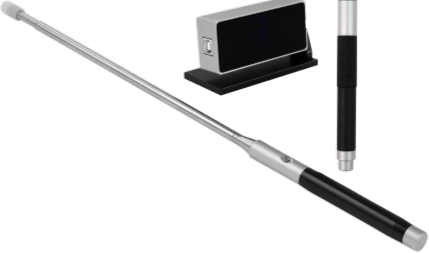
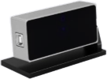

Auto Callbratlon Portable Inhl'actlv. WIIItoIIoaI'd "32300  
  
It uses the original optical infrared technology.  
Very precise positioning, tracking a very high  
accuracy, ultra—fast response time, in written,  
comprehensive performance is much better than  
  
ordinary interactive whiteboard.  
Easy to install and maintain .  
  
Whiteboard itself doesn’t need any electronic components, protecting environment and saving energy.  
2: System requiremenls  
1. hardware requirements  
CPU : based on X86 processor , above pentium166  
Memory: 64 MB RAM(reoommend 128 MB RAM)  
Hardware: free space  
2. software requirements  
98l2000/XP/2003Ivistalwin7I8/10lLinux Ubuntu operating system  
